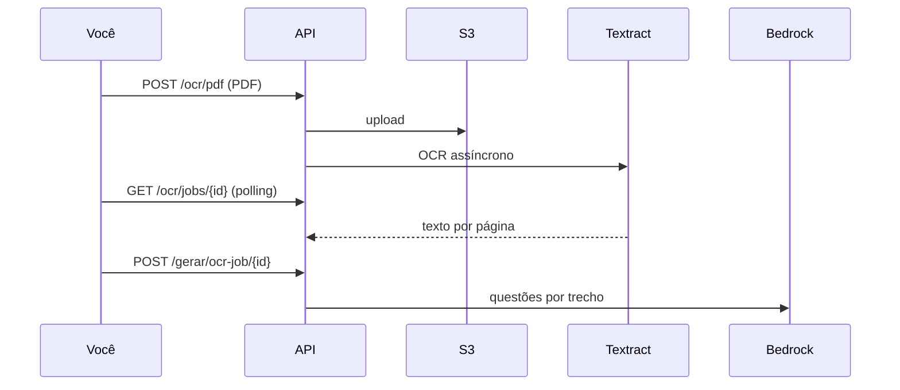

# Gerador de Questões (AWS Bedrock + Textract OCR)


API em Python que gera questões a partir de **texto** ou **PDF**, com **OCR** para livros escaneados (Amazon Textract).
Pensado para estudos médicos (Revalida / Residência / USMLE-like), com formatos de **caso clínico**, **diagnóstico**, **conduta**, **farmacologia**, **cirurgia**, **pediatria**, **obstetrícia**, **emergência (ABCDE)**, **saúde pública** e **interpretação de exame**.


## Recursos principais


- Múltipla escolha **A–D, A–E ou A–F** (padrão A–E).
- Geração em **Português, Inglês ou Italiano**.
- **Resposta comentada** automática: a própria LLM explica por que o gabarito é a alternativa correta e **por que cada distratora está errada**, citando o trecho do material.
- Filtros por **tema**, **palavras-chave** e **intervalo de páginas**.
- **Descoberta de temas** assistida pela LLM (varre o material e sugere assuntos clicáveis).
- **Histórico** local (SQLite): cada PDF/OCR vira `documento`; cada lote vira `geração` com suas `questões` — incluindo as explicações.
- Exportação **CSV** com colunas `alt_A..alt_F`, `expl_A..expl_F`, `explicacao`, `referencia`, `idioma`, `estilo`.


## Duas credenciais AWS


| Uso | Variável | Onde obter |

|-----|----------|------------|

| Gerar questões (LLM) | `AWS_BEARER_TOKEN_BEDROCK` | Bedrock → API keys |

| OCR + S3 | `AWS_ACCESS_KEY_ID` + `AWS_SECRET_ACCESS_KEY` | IAM → Usuário → Chave de acesso |


A chave Bedrock **não** substitui IAM para Textract.


## Pré-requisitos


1. Python 3.9+

2. Bedrock: modelo habilitado (ex. Claude 3.5 Haiku) + API key ou IAM

3. **S3**: bucket na mesma região (`AWS_REGION`)

4. **IAM** com Textract + S3 (policy exemplo abaixo)

5. Model access no Bedrock


## Instalação


```powershell

cd c:\Users\Kayron\Pictures\llm_geraQuestion

python -m venv .venv

.\.venv\Scripts\Activate.ps1

pip install -r requirements.txt

copy .env.example .env

```


Edite `.env`:


```env

AWS_BEARER_TOKEN_BEDROCK=ABSK...

AWS_REGION=us-east-1

BEDROCK_MODEL_ID=anthropic.claude-3-5-haiku-20241022-v1:0


AWS_ACCESS_KEY_ID=AKIA...

AWS_SECRET_ACCESS_KEY=...

S3_BUCKET=seu-bucket-aqui

```


## Policy IAM (OCR)


Anexe ao usuário das Access Keys:


```json

{

  "Version": "2012-10-17",

  "Statement": [

    {

      "Effect": "Allow",

      "Action": [

        "s3:PutObject",

        "s3:GetObject",

        "s3:DeleteObject"

      ],

      "Resource": "arn:aws:s3:::SEU-BUCKET/*"

    },

    {

      "Effect": "Allow",

      "Action": [

        "textract:StartDocumentTextDetection",

        "textract:GetDocumentTextDetection"

      ],

      "Resource": "*"

    }

  ]

}

```


## Policy do bucket S3 (Textract)

Bucket → Permissões → política do bucket, se aparecer erro de metadata S3:

```json
{
  "Version": "2012-10-17",
  "Statement": [{
    "Effect": "Allow",
    "Principal": { "Service": "textract.amazonaws.com" },
    "Action": ["s3:GetObject", "s3:GetBucketLocation"],
    "Resource": [
      "arn:aws:s3:::SEU-BUCKET",
      "arn:aws:s3:::SEU-BUCKET/*"
    ]
  }]
}
```

`AWS_REGION` no `.env` = mesma região do bucket (Ohio → `us-east-2`).

## Executar


```powershell

python run.py

```


- **Interface (upload):** http://localhost:8000  
- **API Swagger:** http://localhost:8000/docs


## Fluxo: livro escaneado (ex. 1800 páginas)





### 1. Teste com poucas páginas primeiro


```powershell

curl.exe -X POST "http://localhost:8000/ocr/pdf" `

  -F "arquivo=@C:\caminho\livro.pdf" `

  -F "pagina_inicio=1" `

  -F "pagina_fim=10"

```


Resposta: `job_id`.


### 2. Acompanhar OCR


```powershell

curl.exe http://localhost:8000/ocr/jobs/SEU_JOB_ID

```


Aguarde `"status": "succeeded"` (10 páginas ≈ minutos; 1800 páginas ≈ 30–90 min).


### 3. Gerar questões do texto OCR


```powershell

curl.exe -X POST "http://localhost:8000/gerar/ocr-job/SEU_JOB_ID?max_chunks=5&num_questoes_por_chunk=2"

```


Use `max_chunks` baixo em livros enormes para não estourar custo/tempo do Bedrock.


### 4. Livro completo (1800 páginas)


```powershell

curl.exe -X POST "http://localhost:8000/ocr/pdf" -F "arquivo=@livro.pdf"

```


**Custo Textract (ordem de grandeza):** ~US$ 1,50 / 1000 páginas → ~US$ 2,70 para 1800 páginas.  

**Bedrock:** depende de quantos trechos você processar (`max_chunks`).


## Endpoints


| Método | Rota | Descrição |

|--------|------|-----------|

| POST | `/ocr/pdf` | Inicia OCR em background |

| GET | `/ocr/jobs/{job_id}` | Status do OCR |

| POST | `/gerar/ocr-job/{job_id}` | Questões a partir do OCR pronto |

| POST | `/gerar/texto` | Texto colado |

| POST | `/gerar/pdf` | PDF com texto selecionável (sem OCR) |


## PDF digital (sem scan)


`POST /gerar/pdf` — extrai texto com PyMuPDF, sem Textract.


## Estrutura


```

app/

  main.py

  generator.py

  textract_ocr.py   # S3 + Textract

  ocr_jobs.py       # Jobs em data/ocr_jobs/

  pdf_utils.py      # Recorte de páginas

  pdf_extractor.py

  bedrock.py

  chunker.py

```


## Custos e limites


- Upload até `MAX_PDF_UPLOAD_MB` (padrão 500 MB)

- OCR: Textract cobra por página

- Questões: 1 chamada Bedrock por trecho; use `max_chunks` em livros grandes


